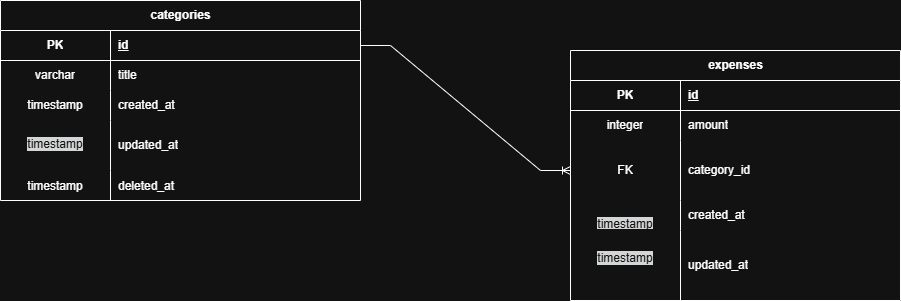

# Money Manager

A simple expense tracking application built with ASP.NET Core. The goal of this project is to help users record and organize their expenses by category.

## Features

- Create expense categories
- Add expenses
- View all expenses
- Update expenses
- Delete expenses
- Categorize expenses

## Technologies

- ASP.NET Core
- Entity Framework Core
- SQL Server
- C#
- REST API

## Project Structure

```
MoneyManager/
│
├── Controllers/
├── Models/
├── Data/
├── Services/
├── Docs/
│   └── ERD.png
└── README.md
```

## Database

### Entity Relationship Diagram (ERD)



### Tables

#### Categories

| Column | Type |
|---------|------|
| Id | int |
| Title | string |
| CreatedAt | datetime |
| UpdatedAt | datetime |
| DeletedAt | datetime (nullable) |

#### Expenses

| Column | Type |
|---------|------|
| Id | int |
| Amount | decimal |
| CategoryId | int |
| CreatedAt | datetime |
| UpdatedAt | datetime |

Relationship:

- One Category can have many Expenses.
- Each Expense belongs to one Category.

## Getting Started

### Prerequisites

- .NET 10 SDK
- SQL Server
- JetBrains Rider 2025 / Visual Studio 2022 / VS Code

### Installation

Clone the repository

```bash
git clone https://github.com/Nazaninns/money-manager.git
```

Go to the project

```bash
cd money-manager
```

Restore packages

```bash
dotnet restore
```

Apply migrations

```bash
dotnet ef database update
```

Run the application

```bash
dotnet run
```

## API Endpoints

### Categories

| Method | Endpoint |
|---------|----------|
| GET | /api/categories |
| GET | /api/categories/{id} |
| POST | /api/categories |
| PUT | /api/categories/{id} |
| DELETE | /api/categories/{id} |

### Expenses

| Method | Endpoint |
|---------|----------|
| GET | /api/expenses |
| GET | /api/expenses/{id} |
| POST | /api/expenses |
| PUT | /api/expenses/{id} |
| DELETE | /api/expenses/{id} |

## Future Improvements

- User authentication
- Monthly reports
- Budget tracking
- Dashboard
- Export to Excel/PDF

## License

This project is for learning purposes.